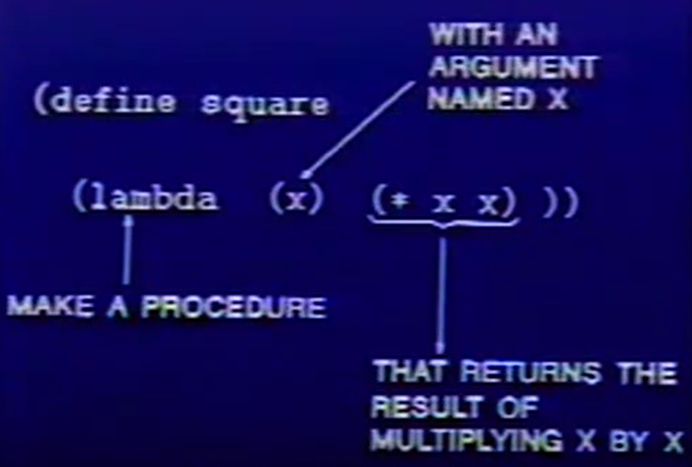
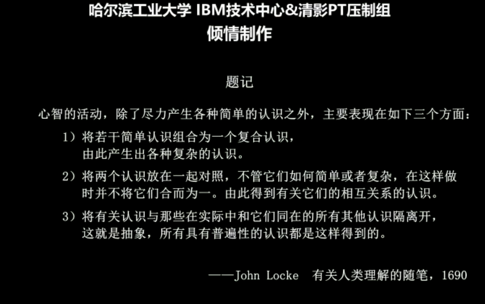
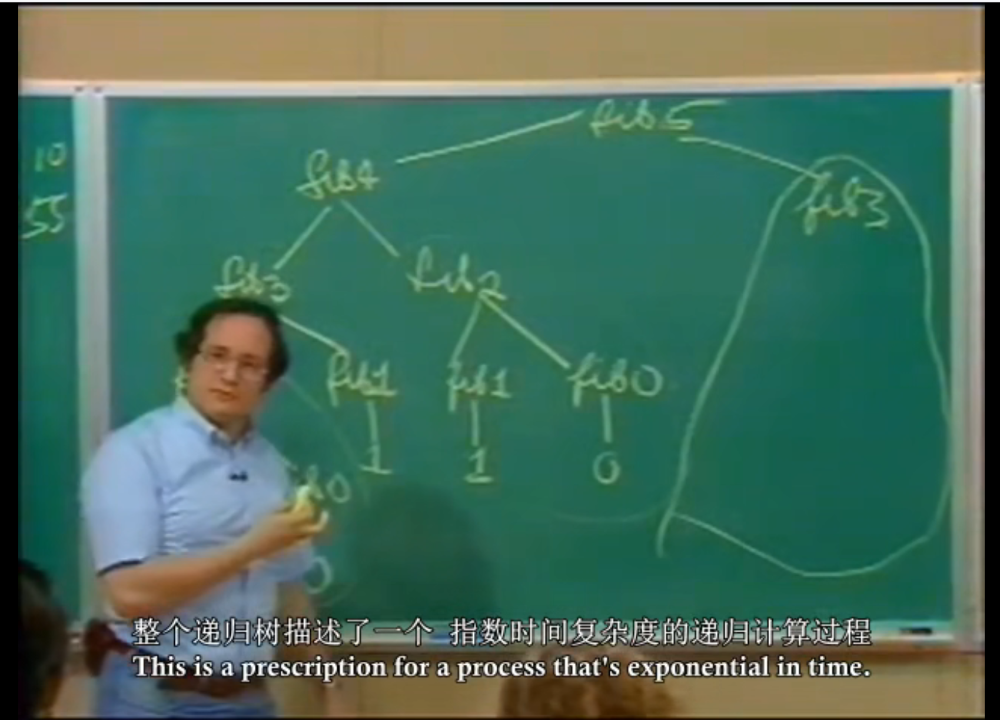
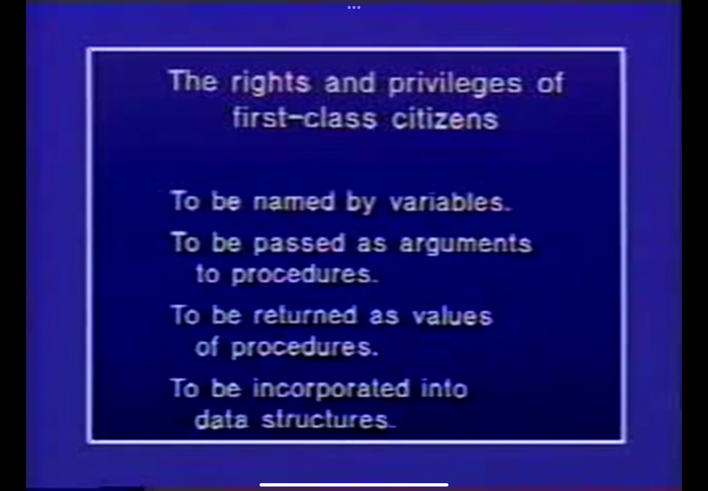

# SICP course notes

This plan gonna begin in 4.9 and each day for a part


<!-- vim-markdown-toc Marked -->

* [Lec1a: Lisp概览 Time 2022 4.9](#lec1a:-lisp概览-time-2022-4.9)
    * [Part1 technique for controlling complexity](#part1-technique-for-controlling-complexity)
    * [Part2 General framework](#part2-general-framework)
* [Lec1b: 计算过程 Time 2022 4.10](#lec1b:-计算过程-time-2022-4.10)
    * [part1](#part1)
    * [part2](#part2)
    * [part3](#part3)
* [Lec2A 2022 4.11](#lec2a-2022-4.11)
    * [part1](#part1)

<!-- vim-markdown-toc -->


## Lec1a: Lisp概览 Time 2022 4.9


### Part1 technique for controlling complexity
- black-box abstraction
- Conventional interfaces
- Metaliguistic abstraction -- making new languages

### Part2 General framework
- primitive elements
- means of combination
- measn of abstraction

``` Lisp
 (+ 3 17.4 5)   = 25.5
```


**syntactic sugar** 


``` Lisp

//**RECURSIVE DEFINITION** 
// x for the orginal number while guess for the guess number
// so in this example 'guess' and 'x' are all primitive elements
// while "try" | "good-enough" | "average" and so on are means of combination

(DEFINE (TRY GUESS X)  
    (IF (GOOD-ENOUGH? GUESS X)  
        GUESS  
        (TRY (IMPROVE GUESS X) X)))
        
(define (improve guess x)  
    (average guess (/ x guess)))
    
// process (good-enough? guess x) return false or true

(define (good-enough? guess x)  
    (< (abs (- (square guess) x)) .001))
    
```


- block structure

Q: what's the difference between the clause  
    (define A (* 5 5)) AND (define (D) (* 5 5))  
A: In the Lisp command, input  
    A -> 25 while the second  
    D -> compound procedure D  
    (D) -> 25 //running procedure D  
    (A) -> error  
      
    for A is the primitive element while D is a procedure  
    
    
## Lec1b: 计算过程 Time 2022 4.10

### part1

kinds of expressions
- numbers
- symbols
- special rules
    - Lambda expressions
    - definitions
    - conditions
    - combinations


### part2

**the difference between interation and recursion** 

```
example: add x and y  
        1st definition method -> (define (+ x y)  
                                    (if (= x 0)  
                                        y  
                                        (+ (-1+ x) (1+ y))))  
        2nd definition method -> (define (+ x y)  
                                    (if (= x 0)  
                                        y  
                                        (1+ (+ (-1+ x) y))))  
                    
```
different shape as follows:
```Lisp
(+ 3 4)
 1st def_med -> (+ 3 4)  
                (+ 2 5)
                (+ 1 6)
                (+ 0 7)
                -> 7
 2nd def_med -> (+ 3 4)
                (1+ (+ 2 4))
                (1+ (1+ (+ 1 4)))
                (1+ (1+ (1+ (+ 0 4))))
                (1+ (1+ (1+ 4)))
                (1+ (1+ 5))
                (1+ 6)
                -> 7

it's easy to recognize that 1st med is an iteration approach and 2nd med is a recursion approach.
```


Notes:  
1. interation only changes the arguments each part  
    while recursion not only changes the arguments but also changes the shape each part returns
2. 1st complexity analyze : Time complexity O(x) | Space complexity O(1)  
   2nd complexity analyze : Time complexity O(x) | Space complexity O(x)


### part3



fib square


``` Lisp
    (define (fib N)
        (if (< N 2)
            N
            (+ (fib (- N 1)) (fib (- N 2)))))
```

time = O(fib(x))  
space = O(n)


Q after-class : How to write one using iteration approach?

``` Lisp
A1: 2022 4.10
    (define (fib N x y)
        (if (< N 3)
            y
            (fib (-1+ N) y (+ x y))))

->  (fib 4 0 1)
    (fib 3 1 2)
    (fib 2 2 3)
    -> 3
    
A2: 2022 4.11 another recursion approach
    (define (fib N x y)
        (if (< N 3)
            y
            (+ x (fib (-1+ N y (+ x y))))))
```


## Lec2A 2022 4.11

### part1

higher-order procedure : seeing procedure as a parameter

``` 
(define (sum term A next B)
    (if (> A B)
        0
        (+ (term A)
           (sum term
                (next A)
                next
                B))))
                
instantiation 1:
(define (sum-int A B)
    (define (identity x) x)
    (sum identity
         A
         1+
         B))

Note: identity as term, (define (identity x) x) is just to not change the value of A and output A

instantiation 2:
(define (sum-sq A B)
    (sum square
         A
         1+
         B))


instantiation 3:
(define (pi-sum A B)
    (sum (Lambda(i) (/ 1 (* i (+ i 2))))
         A
         (Lambda(i) (+ i 4))
         B))
```


 

 

